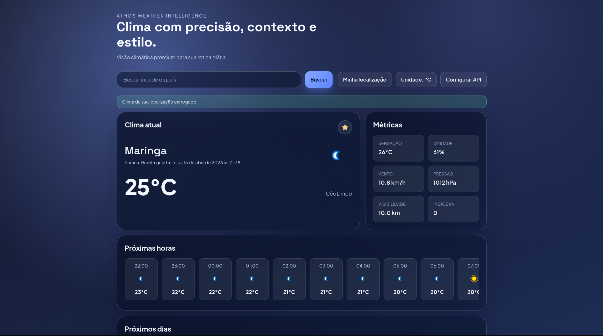

<div align="center">
  <h1>Atmos Weather Visualizer</h1>
  <p><i>Weather app built with HTML, CSS, and Vanilla JavaScript focused on UX, performance, and modular architecture.</i></p>

  <p>
    
    
    
    <a href="./LICENSE"></a>
  </p>
</div>

---

## Preview

Main application interface:



---

## Overview

**Atmos Weather Visualizer** is a front-end weather app that delivers real-time forecasts with a premium interface and local persistence for user preferences.

The project is designed as a solid product-grade front-end base, with:

- semantic and accessible HTML
- modular architecture using Vanilla JavaScript (ES Modules)
- clear separation between integration, state, rendering, and utilities
- responsive experience with loading, error, and success feedback

---

## Key Features

- Weather search by city/country
- Geolocation with fallback to a default city
- Current weather with complementary metrics
- Hourly forecast (next hours)
- Daily forecast (next days)
- Search history with deduplication and limit
- Persistent favorites with quick removal
- Unit toggle between `°C` and `°F`
- API key setup directly in the UI
- Dynamic visual theme based on weather conditions
- Skeleton loading and retry-based error state

---

## Architecture

Main application flow:

1. `scripts/app.js` initializes UI elements, event listeners, and bootstrap.
2. `scripts/weather.js` orchestrates state, cache, search flow, and domain rules.
3. `scripts/api.js` centralizes WeatherAPI HTTP calls and data normalization.
4. `scripts/ui.js` renders weather, metrics, lists, placeholders, and status messages.
5. `scripts/storage.js` persists history, favorites, unit, and API key in `localStorage`.
6. `scripts/utils.js` provides formatting, validation, and weather theme mapping.

Principles:

- no mixing of integration logic with visual rendering
- parsing/normalization in dedicated layer
- explicit and predictable state

---

## Performance

Current performance strategy:

- in-memory cache to reduce repeated API calls (10-minute window)
- request timeout to avoid stuck UX
- incremental rendering with skeleton states
- smooth transitions and micro-interactions

Note: there is currently no versioned automated benchmark in this repository.

---

## Technical Challenges

- balancing premium UI with maintainable CSS
- keeping accessibility and responsiveness without UI frameworks
- handling async states with consistent UX for loading/success/error
- preventing coupling between domain rules and presentation

---

## Roadmap

- Air Quality Index (AQI)
- Weather alerts
- Internationalization (i18n)
- Automated flow tests and visual regression testing
- Optional backend/edge strategy to protect API keys in production

---

## Stack

- Semantic HTML5
- CSS3 (file-based architecture)
- Vanilla JavaScript with ES Modules
- WeatherAPI
- `localStorage`

---

## Project Structure

```text
.
├── .github/
│   ├── ISSUE_TEMPLATE/
│   │   ├── bug_report.md
│   │   └── feature_request.md
│   └── PULL_REQUEST_TEMPLATE.md
├── assets/
├── docs/
│   ├── assets/
│   │   └── preview.png
│   └── README.md
├── scripts/
│   ├── api.js
│   ├── app.js
│   ├── storage.js
│   ├── ui.js
│   ├── utils.js
│   └── weather.js
├── styles/
│   ├── components.css
│   ├── main.css
│   ├── reset.css
│   ├── responsive.css
│   └── variables.css
├── CHANGELOG.md
├── CODE_OF_CONDUCT.md
├── CONTRIBUTING.md
├── index.html
├── LICENSE
├── README.md
├── SECURITY.md
└── SUPPORT.md
```

---

## How to Run

Prerequisite: serve files using a local server (`ES Modules` do not run on `file://`).

### 1) Clone the project

```bash
git clone git@github.com:NullCipherr/Atmos-Weather-Visualizer.git
cd Atmos-Weather-Visualizer
```

### 2) Start a local server

```bash
python3 -m http.server 5500
```

or

```bash
npx serve .
```

### 3) Open in browser

- `http://localhost:5500`

### 4) Configure API key

1. Generate your key at [WeatherAPI](https://www.weatherapi.com/).
2. Click **Configure API** in the app.
3. Paste and save your key.

Important: the key is stored in your browser `localStorage`.

---

## Deployment

As a static project, it can be deployed to:

- GitHub Pages
- Netlify
- Vercel (static mode)
- Cloudflare Pages

Minimum production checklist:

- validate API key exposure policy
- configure cache headers for static assets
- review SEO metadata (`title`, `description`, Open Graph)

---

## Open Source Documentation

- [Contributing Guide](./CONTRIBUTING.md)
- [Code of Conduct](./CODE_OF_CONDUCT.md)
- [Security Policy](./SECURITY.md)
- [Support](./SUPPORT.md)
- [Changelog](./CHANGELOG.md)

---

## License

This project is licensed under the **MIT License**.

See [LICENSE](./LICENSE).

---

<div align="center">
  Built by <b>Andrei Costa</b> and the open source community.
</div>
